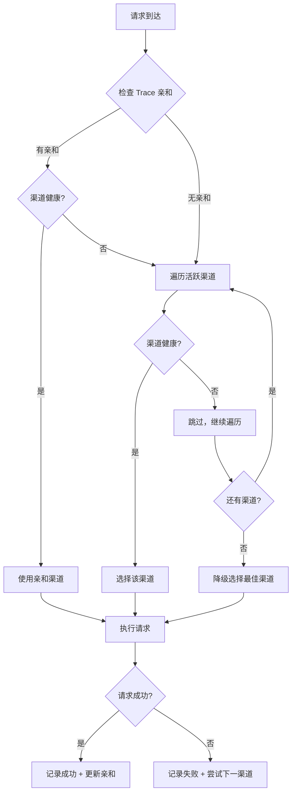
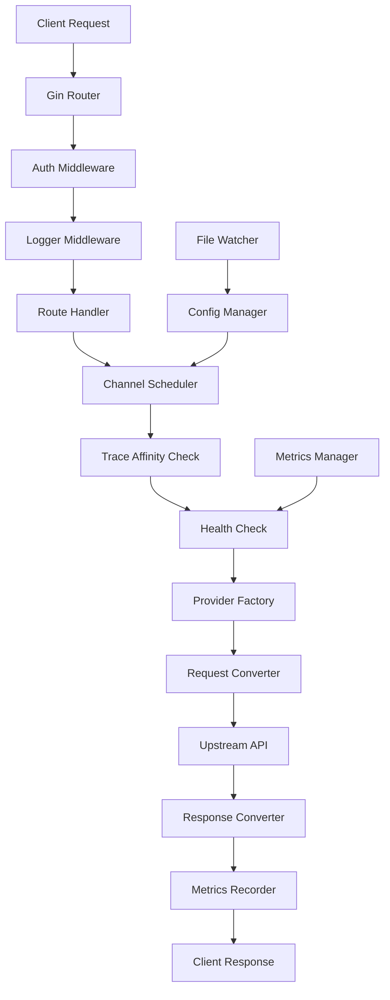
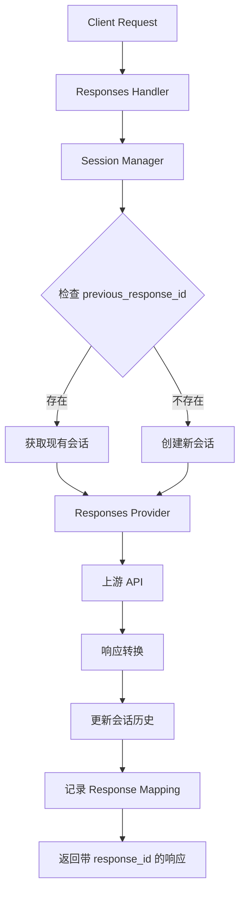

# 项目架构与设计

本文档详细介绍 Claude / Codex / Gemini API Proxy 的架构设计、技术选型和实现细节。

## 项目结构

项目采用一体化架构，Go 后端嵌入前端构建产物，实现单二进制部署：

```
claude-proxy/
├── backend-go/              # Go 后端服务（主程序）
│   ├── main.go             # 程序入口
│   ├── internal/           # 内部实现
│   │   ├── config/        # 配置管理
│   │   ├── handlers/      # HTTP 处理器
│   │   ├── middleware/    # 中间件
│   │   ├── providers/     # 上游服务适配器
│   │   ├── converters/    # Responses API 协议转换器
│   │   ├── scheduler/     # 多渠道调度器
│   │   ├── session/       # 会话管理
│   │   └── metrics/       # 渠道指标监控
│   ├── .config/           # 运行时配置
│   │   ├── config.json    # 主配置文件
│   │   └── backups/       # 配置备份 (保留最近10个)
│   └── .env               # 环境变量
├── frontend/               # Vue 3 + Vuetify 前端
│   ├── src/
│   │   ├── components/    # Vue 组件
│   │   ├── services/      # API 服务
│   │   └── styles/        # 样式文件
│   ├── public/            # 静态资源
│   └── dist/              # 构建产物（嵌入到 Go 二进制）
├── Makefile               # 构建和开发命令
├── docker-compose.yml     # Docker 部署配置
└── Dockerfile             # 容器镜像定义
```

## 核心技术栈

### 后端 (backend-go/)

- **运行时**: Go 1.22+
- **框架**: Gin Web Framework
- **配置管理**: fsnotify (热重载) + godotenv
- **前端嵌入**: Go `embed.FS`
- **并发模型**: 原生 Goroutine
- **性能优势**:
  - 启动时间: < 100ms (vs Node.js 2-3s)
  - 内存占用: ~20MB (vs Node.js 50-100MB)
  - 部署包大小: ~15MB (vs Node.js 200MB+)

### 前端 (frontend/)

- **框架**: Vue 3 (Composition API)
- **UI 组件库**: Vuetify 3
- **UI 主题**: 复古像素 (Neo-Brutalism)
- **构建工具**: Vite
- **状态管理**: Vue Composition API
- **HTTP 客户端**: Fetch API

### 构建系统

- **包管理器**: Bun (推荐) / npm / pnpm
- **构建工具**: Makefile + Shell Scripts
- **跨平台编译**: 支持 Linux/macOS/Windows, amd64/arm64

## 模块索引

| 模块           | 路径                              | 职责                        |
| -------------- | --------------------------------- | --------------------------- |
| **后端核心**   | `backend-go/`                     | API 代理、协议转换、配置管理 |
| **前端界面**   | `frontend/`                       | Web 管理界面、渠道配置       |
| **提供商适配** | `backend-go/internal/providers/`  | 上游服务协议转换            |
| **配置系统**   | `backend-go/internal/config/`     | 配置文件管理和热重载        |
| **HTTP 处理**  | `backend-go/internal/handlers/`   | REST API 路由和业务逻辑     |
| **中间件**     | `backend-go/internal/middleware/` | 认证、日志、CORS            |
| **会话管理**   | `backend-go/internal/session/`    | Responses API 会话跟踪      |
| **调度器**     | `backend-go/internal/scheduler/`  | 多渠道智能调度              |
| **指标管理**   | `backend-go/internal/metrics/`    | 渠道健康度和性能指标        |

## 设计模式

### 1. 提供商模式 (Provider Pattern)

所有上游 AI 服务都实现统一的 `Provider` 接口，实现协议转换：

```go
type Provider interface {
    // 将 Claude 格式请求转换为上游格式
    ConvertRequest(claudeRequest *ClaudeRequest) (*UpstreamRequest, error)

    // 将上游响应转换为 Claude 格式
    ConvertResponse(upstreamResponse *UpstreamResponse) (*ClaudeResponse, error)

    // 处理流式响应
    StreamResponse(upstream io.Reader, downstream io.Writer) error
}
```

**已实现的提供商**:
- `OpenAI`: 支持 OpenAI API 和兼容 API
- `Gemini`: Google Gemini API
- `Claude`: Anthropic Claude API (直接透传)
- `Responses`: Codex Responses API (支持会话管理)
- `OpenAI Old`: 旧版 OpenAI API 兼容

### 2. 配置管理器模式

`ConfigManager` 负责配置的生命周期管理：

```go
type ConfigManager struct {
    config     *Config
    configPath string
    watcher    *fsnotify.Watcher
    mu         sync.RWMutex
}

// 核心功能
func (cm *ConfigManager) Load() error
func (cm *ConfigManager) Save() error
func (cm *ConfigManager) Watch() error
func (cm *ConfigManager) GetNextAPIKey(channelID string) (string, error)
```

**特性**:
- 配置文件热重载 (无需重启服务)
- 自动备份机制 (保留最近 10 个版本)
- 线程安全的读写操作
- API 密钥轮询策略

### 3. 会话管理模式 (Session Manager)

为 Responses API 提供有状态的多轮对话支持：

```go
type SessionManager struct {
    sessions       map[string]*Session
    responseMap    map[string]string  // responseID -> sessionID
    mu             sync.RWMutex
    expiration     time.Duration
    maxMessages    int
    maxTokens      int
}

// 核心功能
func (sm *SessionManager) GetOrCreateSession(previousResponseID string) (*Session, error)
func (sm *SessionManager) AppendMessage(sessionID string, item ResponsesItem, tokens int)
func (sm *SessionManager) UpdateLastResponseID(sessionID, responseID string)
func (sm *SessionManager) RecordResponseMapping(responseID, sessionID string)
```

**特性**:
- 自动会话创建和关联
- 基于 `previous_response_id` 的会话追踪
- 限制消息数量（默认 100 条）
- 限制 Token 总数（默认 100k）
- 自动过期清理（默认 24 小时）
- 线程安全的并发访问

**会话流程**:
1. 首次请求：创建新会话，返回 `response_id`
2. 后续请求：通过 `previous_response_id` 查找会话
3. 自动追加用户输入和模型输出
4. 响应中包含 `previous_id` 链接历史

### 4. 转换器模式 (Converter Pattern) 🆕

**v2.0.5 新增**：为 Responses API 提供统一的协议转换架构。

#### 转换器接口

```go
type ResponsesConverter interface {
    // 将 Responses 请求转换为上游服务格式
    ToProviderRequest(sess *session.Session, req *types.ResponsesRequest) (interface{}, error)

    // 将上游响应转换为 Responses 格式
    FromProviderResponse(resp map[string]interface{}, sessionID string) (*types.ResponsesResponse, error)

    // 获取上游服务名称
    GetProviderName() string
}
```

#### 已实现的转换器

| 转换器 | 文件 | 转换方向 |
|--------|------|----------|
| `OpenAIChatConverter` | `openai_converter.go` | Responses ↔ OpenAI Chat Completions |
| `OpenAICompletionsConverter` | `openai_converter.go` | Responses ↔ OpenAI Completions |
| `ClaudeConverter` | `claude_converter.go` | Responses ↔ Claude Messages API |
| `ResponsesPassthroughConverter` | `responses_passthrough.go` | Responses ↔ Responses (透传) |

#### 工厂模式

```go
func NewConverter(serviceType string) ResponsesConverter {
    switch serviceType {
    case "openai":
        return &OpenAIChatConverter{}
    case "claude":
        return &ClaudeConverter{}
    case "responses":
        return &ResponsesPassthroughConverter{}
    default:
        return &OpenAIChatConverter{}
    }
}
```

#### 核心转换逻辑

**1. Instructions 字段处理**

```go
// OpenAI: instructions → messages[0] (role: system)
if req.Instructions != "" {
    messages = append(messages, map[string]interface{}{
        "role": "system",
        "content": req.Instructions,
    })
}

// Claude: instructions → system 参数（独立字段）
if req.Instructions != "" {
    claudeReq["system"] = req.Instructions
}
```

**2. 嵌套 Content 数组提取**

```go
func extractTextFromContent(content interface{}) string {
    // 1. 如果是 string，直接返回
    if str, ok := content.(string); ok {
        return str
    }

    // 2. 如果是 []ContentBlock，提取 input_text/output_text
    if arr, ok := content.([]interface{}); ok {
        texts := []string{}
        for _, c := range arr {
            if block["type"] == "input_text" || block["type"] == "output_text" {
                texts = append(texts, block["text"])
            }
        }
        return strings.Join(texts, "\n")
    }

    return ""
}
```

**3. Message Type 区分**

```go
switch item.Type {
case "message":
    // 新格式：嵌套结构（type=message, role=user/assistant, content=[]ContentBlock）
    role := item.Role  // 直接从 item.role 获取
    contentText := extractTextFromContent(item.Content)

case "text":
    // 旧格式：简单 string（向后兼容）
    contentStr := extractTextFromContent(item.Content)
    role := item.Role  // 使用 role 字段，不再依赖 [ASSISTANT] 前缀
}
```

#### 架构优势

- **易于扩展** - 新增上游只需实现 `ResponsesConverter` 接口
- **职责清晰** - 转换逻辑与 Provider 解耦
- **可测试性** - 每个转换器可独立测试
- **代码复用** - 公共逻辑提取到 `extractTextFromContent` 等基础函数
- **统一流程** - 所有上游使用相同的转换流程

#### 使用示例

```go
// 在 ResponsesProvider 中使用
converter := converters.NewConverter(upstream.ServiceType)
providerReq, err := converter.ToProviderRequest(sess, &responsesReq)
```

#### 支持的 Responses API 格式

```json
{
  "model": "gpt-4",
  "instructions": "You are a helpful assistant.",  // ✅ 新增
  "input": [
    {
      "type": "message",  // ✅ 新增
      "role": "user",     // ✅ 新增
      "content": [
        {
          "type": "input_text",  // ✅ 新增
          "text": "Hello!"
        }
      ]
    }
  ],
  "previous_response_id": "resp_xxxxx",
  "max_tokens": 1000
}
```

**对比旧格式**：

```json
{
  "model": "gpt-4",
  "input": [
    {
      "type": "text",
      "content": "Hello!"  // 简单 string
    },
    {
      "type": "text",
      "content": "[ASSISTANT]Hi there!"  // ❌ 使用前缀 hack
    }
  ]
}
```

### 5. 多渠道调度模式 (Channel Scheduler) 🆕

**v2.0.11 新增**：智能多渠道调度系统，支持优先级排序、健康检查和故障转移。

#### 核心组件

```go
// ChannelScheduler 多渠道调度器
type ChannelScheduler struct {
    configManager           *config.ConfigManager
    messagesMetricsManager  *metrics.MetricsManager
    responsesMetricsManager *metrics.MetricsManager
    traceAffinity           *session.TraceAffinityManager
}

// SelectChannel 选择最佳渠道
func (s *ChannelScheduler) SelectChannel(
    ctx context.Context,
    userID string,
    failedChannels map[int]bool,
    isResponses bool,
) (*SelectionResult, error)
```

#### 调度优先级

调度器按以下优先级选择渠道：

```
1. Trace 亲和性检查
   └─ 同一用户优先使用之前成功的渠道
        ↓ (无亲和记录或渠道不健康)
2. 健康检查
   └─ 跳过失败率 >= 50% 的渠道
        ↓ (渠道健康)
3. 优先级排序
   └─ 按 priority 字段排序（数字越小优先级越高）
        ↓ (所有健康渠道都失败)
4. 降级选择
   └─ 选择失败率最低的渠道
```

#### 渠道状态

```go
type UpstreamConfig struct {
    // ... 其他字段
    Priority int    `json:"priority"` // 优先级（数字越小越高）
    Status   string `json:"status"`   // active | suspended | disabled
}
```

| 状态 | 参与调度 | 故障转移 | 说明 |
|------|----------|----------|------|
| `active` | ✅ | ✅ | 正常运行 |
| `suspended` | ✅ | ✅ | 暂停但保留在序列中（被健康检查跳过） |
| `disabled` | ❌ | ❌ | 备用池，完全不参与 |

> ⚠️ **状态 vs 熔断的区别**：
> - `status: suspended` 是**配置层面**的状态，需要手动改为 `active` 才能恢复
> - 运行时熔断（`CircuitBrokenAt`）是**指标层面**的临时保护，15 分钟后自动恢复
> - 启动时就是 `suspended` 的渠道不会触发自动恢复逻辑

#### 指标管理

```go
// MetricsManager 渠道指标管理
type MetricsManager struct {
    metrics             map[int]*ChannelMetrics
    windowSize          int           // 滑动窗口大小（默认 10）
    failureThreshold    float64       // 失败率阈值（默认 0.5）
    circuitRecoveryTime time.Duration // 熔断恢复时间（默认 15 分钟）
}

// 核心方法
func (m *MetricsManager) RecordSuccess(channelIndex int)
func (m *MetricsManager) RecordFailure(channelIndex int)
func (m *MetricsManager) CalculateFailureRate(channelIndex int) float64
func (m *MetricsManager) IsChannelHealthy(channelIndex int) bool
```

**滑动窗口算法**：
- 基于最近 N 次请求（默认 10 次）计算失败率
- 失败率 >= 50% 触发熔断，记录 `CircuitBrokenAt` 时间戳
- 熔断恢复方式：
  - **自动恢复**：15 分钟后后台任务自动重置滑动窗口
  - **成功请求恢复**：任意成功请求立即清除熔断状态
  - **手动恢复**：通过 API 调用 `Reset()` 重置

#### Trace 亲和性

```go
// TraceAffinityManager 用户会话亲和性
type TraceAffinityManager struct {
    affinity map[string]*TraceAffinity // key: user_id
    ttl      time.Duration             // 默认 30 分钟
}

// 核心方法
func (m *TraceAffinityManager) GetPreferredChannel(userID string) (int, bool)
func (m *TraceAffinityManager) SetPreferredChannel(userID string, channelIndex int)
```

**工作原理**：
1. 用户首次请求 → 调度器选择渠道 → 记录亲和关系
2. 用户后续请求 → 优先使用之前成功的渠道
3. 渠道不健康或 30 分钟无活动 → 清除亲和记录

#### 调度流程图



### 6. 中间件模式

Express/Gin 使用中间件架构处理横切关注点：

```go
// 认证中间件
func AuthMiddleware() gin.HandlerFunc

// 日志记录中间件
func LoggerMiddleware() gin.HandlerFunc

// 错误处理中间件
func ErrorHandler() gin.HandlerFunc

// CORS 中间件
func CORSMiddleware() gin.HandlerFunc
```

## 数据流图



**Messages API 流程说明**:
1. 客户端请求到达 Gin 路由器
2. 通过认证和日志中间件
3. 路由处理器调用 Channel Scheduler
4. 调度器检查 Trace 亲和性（优先使用历史成功渠道）
5. 健康检查过滤不健康渠道
6. Provider 工厂创建对应的协议转换器
7. 转换请求格式并发送到上游 API
8. 接收上游响应并转换回 Claude 格式
9. 记录指标（成功/失败）并返回给客户端

**Responses API 特殊流程**:


**Responses API 会话管理**:
1. 检查请求中的 `previous_response_id`
2. 如存在，通过 `responseMap` 查找对应的会话
3. 如不存在，创建新的会话 ID
4. 将用户输入追加到会话历史
5. 发送请求到上游 Responses API
6. 将模型输出追加到会话历史
7. 更新会话的 `last_response_id`
8. 记录 `response_id` → `session_id` 映射
9. 返回响应，包含 `id` (当前) 和 `previous_id` (上一轮)

## 技术选型决策

### 前端资源嵌入方案

#### 实现对比

**当前方案**:
```go
//go:embed frontend/dist/*
var frontendFS embed.FS

func ServeStaticFiles(r *gin.Engine) {
    // API 路由优先处理
    r.NoRoute(func(c *gin.Context) {
        path := c.Request.URL.Path

        // 检测 API 路径
        if isAPIPath(path) {
            c.JSON(404, gin.H{"error": "API endpoint not found"})
            return
        }

        // 尝试读取静态文件
        fileContent, err := fs.ReadFile(distFS, path[1:])
        if err == nil {
            contentType := getContentType(path)
            c.Data(200, contentType, fileContent)
            return
        }

        // SPA 回退到 index.html
        indexContent, _ := fs.ReadFile(distFS, "index.html")
        c.Data(200, "text/html; charset=utf-8", indexContent)
    })
}
```

**关键优势**:
1. ✅ **单次嵌入**: 只嵌入一次整个目录,避免重复
2. ✅ **智能文件检测**: 先尝试读取实际文件
3. ✅ **动态 Content-Type**: 根据扩展名返回正确类型
4. ✅ **API 路由优先**: API 404 返回 JSON 而非 HTML
5. ✅ **简洁代码**: 无需自定义 FileSystem 适配器

#### 缓存策略

**已实施**:
- API 路由返回 JSON 格式 404 错误
- 静态文件正确的 MIME 类型检测

**待优化**:
- HTML 文件: `Cache-Control: no-cache, no-store, must-revalidate`
- 静态资源 (.css, .js, 字体): `Cache-Control: public, max-age=31536000, immutable`

### Go vs TypeScript 重写

v2.0.0 将后端完全重写为 Go 语言:

| 指标            | TypeScript/Bun | Go         | 提升      |
| --------------- | -------------- | ---------- | --------- |
| **启动时间**    | 2-3s           | < 100ms    | **20x**   |
| **内存占用**    | 50-100MB       | ~20MB      | **70%↓**  |
| **部署包大小**  | 200MB+         | ~15MB      | **90%↓**  |
| **并发处理**    | 事件循环       | Goroutine  | 原生并发  |
| **部署依赖**    | Node.js 运行时 | 单二进制   | 零依赖    |

**选择 Go 的原因**:
- 高性能和低资源占用
- 单二进制部署,无需运行时
- 原生并发支持,适合高并发场景
- 强类型系统和出色的工具链

## 性能优化

### 智能构建缓存

Makefile 实现了智能缓存机制:

```makefile
.build-marker: $(shell find frontend/src -type f)
	@echo "检测到前端文件变更,重新构建..."
	cd frontend && npm run build
	@touch .build-marker

ensure-frontend-built: .build-marker
```

**性能对比**:

| 场景               | 之前   | 现在      | 提升       |
| ------------------ | ------ | --------- | ---------- |
| 首次构建           | ~10秒  | ~10秒     | 无变化     |
| **无变更重启**     | ~10秒  | **0.07秒** | **142x** 🚀 |
| 有变更重新构建     | ~10秒  | ~8.5秒    | 15%提升    |

### 请求头优化

针对不同上游使用不同的请求头策略:

- **Claude 渠道**: 保留原始请求头 (支持 `anthropic-version` 等)
- **OpenAI/Gemini 渠道**: 最小化请求头 (仅 `Host` 和 `Content-Type`)

这避免了转发无关头部导致上游 API 拒绝请求的问题。

## 安全设计

### 统一认证架构

所有访问入口受 `PROXY_ACCESS_KEY` 保护:

```go
func AuthMiddleware() gin.HandlerFunc {
    return func(c *gin.Context) {
        // 健康检查无需认证
        if c.Request.URL.Path == "/health" {
            c.Next()
            return
        }

        // 验证访问密钥
        apiKey := c.GetHeader("x-api-key")
        if apiKey != expectedKey {
            c.JSON(401, gin.H{"error": "Unauthorized"})
            c.Abort()
            return
        }

        c.Next()
    }
}
```

**受保护的入口**:
1. 前端管理界面 (`/`)
2. 管理 API (`/api/*`)
3. Messages API (`/v1/messages`)
4. Responses API (`/v1/responses`)

**公开入口**:
- 健康检查 (`/health`)

### 敏感信息保护

- API 密钥掩码显示 (仅显示前 8 位和后 4 位)
- 日志中自动隐藏 `Authorization` 头
- 配置文件权限控制 (`.config/` 目录)

## 扩展性

### 添加新的上游服务

1. 在 `internal/providers/` 创建新的 provider 文件
2. 实现 `Provider` 接口
3. 在 `ProviderFactory` 注册新 provider
4. 更新配置文件模式

示例:
```go
// internal/providers/myapi.go
type MyAPIProvider struct{}

func (p *MyAPIProvider) ConvertRequest(req *ClaudeRequest) (*UpstreamRequest, error) {
    // 实现协议转换逻辑
}

// 在 factory 中注册
func GetProvider(providerType string) Provider {
    switch providerType {
    case "myapi":
        return &MyAPIProvider{}
    // ...
    }
}
```

## 文档资源

- **快速开始**: 参见 [README.md](README.md)
- **环境配置**: 参见 [ENVIRONMENT.md](ENVIRONMENT.md)
- **贡献指南**: 参见 [CONTRIBUTING.md](CONTRIBUTING.md)
- **版本历史**: 参见 [CHANGELOG.md](CHANGELOG.md)
