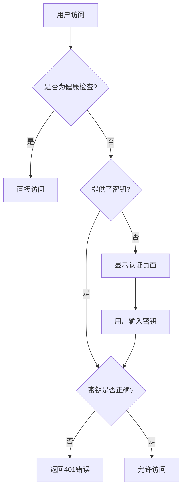

# Claude / Codex / Gemini API Proxy

[](https://github.com/BenedictKing/claude-proxy/releases/latest)
[](https://opensource.org/licenses/MIT)

一个高性能的 Claude API 代理服务器，支持多种上游 AI 服务提供商（Claude、Codex、Gemini），提供负载均衡、多 API 密钥管理和统一入口访问。

## 🚀 功能特性

- **🖥️ 一体化架构**: 后端集成前端，单容器部署，完全替代 Nginx
- **🔐 统一认证**: 一个密钥保护所有入口（前端界面、管理 API、代理 API）
- **📱 Web 管理面板**: 现代化可视化界面，支持渠道管理、实时监控和配置
- **三 API 支持**: 同时支持 Claude Messages API (`/v1/messages`)、Codex Responses API (`/v1/responses`) 和 Gemini API
- **统一入口**: 通过统一端点访问不同的 AI 服务
- **多上游支持**: 支持 Claude、Codex 和 Gemini 等多种上游服务
- **🔌 协议转换**: Messages API 支持协议自动转换，统一接入不同上游服务
- **🎯 智能调度**: 多渠道智能调度器，支持优先级排序、健康检查和自动熔断
- **📊 渠道编排**: 可视化渠道管理，拖拽调整优先级，实时查看健康状态
- **🔄 Trace 亲和**: 同一用户会话自动绑定到同一渠道，提升一致性体验
- **负载均衡**: 支持轮询、随机、故障转移策略，Claude/Codex 负载均衡互不影响
- **多 API 密钥**: 每个上游可配置多个 API 密钥，自动轮换使用（推荐 failover 策略以最大化利用 Prompt Caching）
- **🧠 缓存统计**: 按 Token 口径展示各渠道缓存读/写与命中率（命中率 = `cache_read_tokens / (cache_read_tokens + input_tokens)`）
- **增强的稳定性**: 内置上游请求超时与重试机制，确保服务在网络波动时依然可靠
- **自动重试与密钥降级**: 检测到额度/余额不足等错误时自动切换下一个可用密钥；若后续请求成功，再将失败密钥移动到末尾（降级）；所有密钥均失败时按上游原始错误返回
- **⚡ 自动熔断**: 基于滑动窗口算法检测渠道健康度，失败率过高自动熔断，15 分钟后自动恢复
- **双重配置**: 支持命令行工具和 Web 界面管理上游配置
- **环境变量**: 通过 `.env` 文件灵活配置服务器参数
- **健康检查**: 内置健康检查端点和实时状态监控
- **日志系统**: 完整的请求/响应日志记录
- **📡 支持流式和非流式响应**
- **🛠️ 支持工具调用**
- **💬 会话管理**: Responses API 支持多轮对话的会话跟踪和上下文保持

## 📸 界面预览

### 渠道编排

可视化渠道管理，支持拖拽调整优先级，实时查看渠道健康状态和调度统计。


### 添加渠道

支持多种上游服务类型（Claude/Codex/Gemini），灵活配置 API 密钥、模型映射和请求参数。


### 流量统计

实时监控各渠道的请求流量、成功率和响应延迟，帮助优化调度策略。


## 🏗️ 架构设计

项目采用一体化架构，单容器部署，完全替代 Nginx：

```
用户 → 后端:3000 →
     ├─ / → 前端界面（需要密钥）
     ├─ /api/* → 管理API（需要密钥）
     ├─ /v1/messages → Claude Messages API 代理（需要密钥）
     ├─ /v1/responses → Codex Responses API 代理（需要密钥）
     ├─ /v1/models → Models API（需要密钥）
     └─ /v1beta/models/* → Gemini API 代理（需要密钥）
```

**核心优势**: 单端口、统一认证、无跨域问题、资源占用低

> 📚 详细架构设计和技术选型请参考 [ARCHITECTURE.md](ARCHITECTURE.md)

> 💡 **负载均衡提示**: 本项目内置的负载均衡策略（failover/round-robin）适用于大多数场景。如果您需要更高级的负载均衡功能（如加权分配、健康检查间隔自定义、更复杂的路由策略等），建议在本服务前添加 [gpt-load](https://github.com/tbphp/gpt-load) 作为负载均衡层。

## 🏁 快速开始

### 📦 推荐部署方式

我们**强烈推荐**以下两种方式部署，它们经过充分测试，性能优异：

| 部署方式       | 启动时间 | 内存占用 | 适用场景           |
| -------------- | -------- | -------- | ------------------ |
| **📥 直接下载** | 即时     | ~20MB    | 最快上手、无需构建 |
| **🐳 Docker**  | ~2s      | ~25MB    | 生产环境、一键部署 |
| **🚀 源码构建** | <100ms   | ~20MB    | 开发调试、自定义   |

---

### 方式零：📥 直接下载可执行文件（最快）

**无需安装任何依赖，下载即用**

前往 [Releases 页面](https://github.com/BenedictKing/claude-proxy/releases/latest) 下载适合您系统的版本：

| 操作系统 | 架构 | 文件名 |
|---------|------|--------|
| **Windows** | x64 | `claude-proxy-windows-amd64.exe` |
| **Windows** | ARM64 | `claude-proxy-windows-arm64.exe` |
| **macOS** | Intel | `claude-proxy-darwin-amd64` |
| **macOS** | Apple Silicon | `claude-proxy-darwin-arm64` |
| **Linux** | x64 | `claude-proxy-linux-amd64` |
| **Linux** | ARM64 | `claude-proxy-linux-arm64` |

**快速启动：**

```bash
# Linux / macOS
chmod +x claude-proxy-*
./claude-proxy-linux-amd64  # 或对应的文件名

# Windows (PowerShell)
.\claude-proxy-windows-amd64.exe
```

**配置方式：**

1. 创建 `.env` 文件（与可执行文件同目录）:
```bash
PROXY_ACCESS_KEY=your-super-strong-secret-key
PORT=3000
ENABLE_WEB_UI=true
```

2. 启动服务后访问 `http://localhost:3000`

---

### 方式一：🐳 Docker 部署（推荐）

**适合所有用户，无需安装依赖，一键启动**

```bash
# 直接拉取预构建镜像并运行
docker run -d \
  --name claude-proxy \
  -p 3000:3000 \
  -e PROXY_ACCESS_KEY=your-super-strong-secret-key \
  -v $(pwd)/.config:/app/.config \
  crpi-i19l8zl0ugidq97v.cn-hangzhou.personal.cr.aliyuncs.com/bene/claude-proxy:latest
```

或使用 docker-compose：

```bash
# 1. 克隆项目（仅需 docker-compose.yml）
git clone https://github.com/BenedictKing/claude-proxy
cd claude-proxy

# 2. 修改 docker-compose.yml 中的 PROXY_ACCESS_KEY

# 3. 启动服务
docker-compose up -d
```

访问地址：

- **Web 管理界面**: http://localhost:3000
- **Messages API 端点**: http://localhost:3000/v1/messages
- **Responses API 端点**: http://localhost:3000/v1/responses
- **Gemini API 端点**: http://localhost:3000/v1beta/models/{model}:generateContent
- **健康检查**: http://localhost:3000/health

---

### 方式二：🚀 源码构建部署

**适合追求极致性能或需要自定义的用户**

```bash
# 1. 克隆项目
git clone https://github.com/BenedictKing/claude-proxy
cd claude-proxy

# 2. 配置环境变量
cp backend-go/.env.example backend-go/.env
# 编辑 backend-go/.env 文件，设置你的配置

# 3. 启动服务
make run           # 普通用户运行（推荐）
# 或 make dev       # 开发调试（热重载）
# 或 make help      # 查看所有命令
```

**快捷命令说明：**

```bash
make run           # 普通用户运行（自动构建前端并启动后端）
make dev           # 开发调试（后端热重载）
make help          # 查看所有可用命令
```

> 📚 更多配置管理命令详见 `make help`

> 🪟 **Windows 用户**: 如果遇到 `make` 或 `vite` 命令找不到的问题，请参考 [DEVELOPMENT.md#windows-环境配置](DEVELOPMENT.md#-windows-环境配置)

---

## 🐳 Docker 部署详细配置

### 镜像地址

预构建镜像托管在阿里云容器镜像服务：

```
crpi-i19l8zl0ugidq97v.cn-hangzhou.personal.cr.aliyuncs.com/bene/claude-proxy:latest
```

支持 `linux/amd64` 和 `linux/arm64` 架构。

### 自定义部署（本地构建）

如需自定义或二次开发，可使用本地构建：

```yaml
# docker-compose.yml
services:
  claude-proxy:
    build:
      context: .
      dockerfile: Dockerfile  # 国内网络使用 Dockerfile_China
    container_name: claude-proxy
    ports:
      - '3000:3000' # 统一端口
    environment:
      - ENV=production
      - ENABLE_WEB_UI=true # true=一体化, false=纯API
      - PROXY_ACCESS_KEY=your-super-strong-secret-key
      - LOG_LEVEL=info
    volumes:
      - ./.config:/app/.config # 配置持久化
      - ./logs:/app/logs # 日志持久化
    restart: unless-stopped
```

### 云平台一键部署

> ⚠️ **重要提示**: 请挂载持久化存储（云硬盘）到 `/app/.config` 目录，否则重启后渠道配置将丢失。

#### Railway 部署

```bash
# 1. 连接 GitHub 仓库到 Railway
# 2. 设置环境变量 PROXY_ACCESS_KEY
# 3. 挂载 Volume 到 /app/.config
# 4. 自动部署完成，访问分配的域名
```

#### Render 部署

```bash
# 1. 选择 Docker 服务类型
# 2. 连接 GitHub 仓库
# 3. 设置环境变量 PROXY_ACCESS_KEY
# 4. 添加 Disk 挂载到 /app/.config
# 5. 自动构建和部署
```

#### Fly.io 部署

```bash
fly launch --dockerfile Dockerfile
fly secrets set PROXY_ACCESS_KEY=your-super-strong-secret-key
fly volumes create config_data --size 1
# 编辑 fly.toml 添加 [mounts] 配置
fly deploy
```

#### Zeabur 部署

```bash
# 1. Fork 本项目到你的 GitHub 账号
# 2. 在 Zeabur 中连接你的 GitHub 仓库
# 3. 自动检测 Docker 项目
# 4. 设置环境变量 PROXY_ACCESS_KEY
# 5. 添加持久化存储挂载到 /app/.config
# 6. 一键部署
```

## 🔧 配置管理

**两种配置方式**:

1. **Web 界面** (推荐): 访问 `http://localhost:3000` → 输入密钥 → 可视化管理
2. **命令行工具**: `cd backend-go && make help`

> 📚 环境变量配置详见 [ENVIRONMENT.md](ENVIRONMENT.md)

## 🔐 安全配置

### 统一访问控制

所有访问入口均受 `PROXY_ACCESS_KEY` 保护：

1. **前端管理界面** (`/`) - 通过查询参数或本地存储验证密钥
2. **管理 API** (`/api/*`) - 需要 `x-api-key` 请求头
3. **代理 API** (`/v1/messages`) - 需要 `x-api-key` 请求头
4. **健康检查** (`/health`) - 公开访问，无需密钥

### 认证流程



### 生产环境安全清单

```bash
# 1. 生成强密钥 (必须!)
PROXY_ACCESS_KEY=$(openssl rand -base64 32)
echo "生成的密钥: $PROXY_ACCESS_KEY"

# 2. 生产环境配置
ENV=production
ENABLE_REQUEST_LOGS=false
ENABLE_RESPONSE_LOGS=false
LOG_LEVEL=warn
ENABLE_WEB_UI=true

# 3. 网络安全
# - 使用 HTTPS (推荐 Cloudflare CDN)
# - 配置防火墙规则
# - 定期轮换访问密钥
# - 启用访问日志监控
```

### 密钥管理最佳实践

```bash
# 密钥轮换
echo "旧密钥: $OLD_PROXY_ACCESS_KEY"
echo "新密钥: $NEW_PROXY_ACCESS_KEY"

# 更新环境变量
export PROXY_ACCESS_KEY=$NEW_PROXY_ACCESS_KEY

# 重启服务
docker-compose restart claude-proxy
```

## 📖 API 使用

本服务支持以下 API 格式：

1. **Messages API** (`/v1/messages`) - 标准的 Claude API 格式
2. **Messages Token 计数** (`/v1/messages/count_tokens`) - Token 计数
3. **Responses API** (`/v1/responses`) - Codex 格式，支持会话管理
4. **Responses Compact** (`/v1/responses/compact`) - 精简版 Responses API
5. **Models API** (`/v1/models`) - 模型列表查询
6. **Gemini API** (`/v1beta/models/{model}:generateContent`) - Gemini 原生协议

### Messages API - 标准 Claude API 调用

```bash
curl -X POST http://localhost:3000/v1/messages \
  -H "x-api-key: your-proxy-access-key" \
  -H "Content-Type: application/json" \
  -d '{
    "model": "claude-3-5-sonnet-20241022",
    "max_tokens": 100,
    "messages": [
      {"role": "user", "content": "Hello!"}
    ]
  }'
```

### 流式响应

```bash
curl -X POST http://localhost:3000/v1/messages \
  -H "x-api-key: your-proxy-access-key" \
  -H "Content-Type: application/json" \
  -d '{
    "model": "claude-3-5-sonnet-20241022",
    "stream": true,
    "max_tokens": 100,
    "messages": [
      {"role": "user", "content": "Count to 10"}
    ]
  }'
```

### 工具调用

```bash
curl -X POST http://localhost:3000/v1/messages \
  -H "x-api-key: your-proxy-access-key" \
  -H "Content-Type: application/json" \
  -d '{
    "model": "claude-3-5-sonnet-20241022",
    "max_tokens": 1000,
    "tools": [
      {
        "name": "get_weather",
        "description": "获取指定城市的天气信息",
        "input_schema": {
          "type": "object",
          "properties": {
            "city": {"type": "string", "description": "城市名称"}
          },
          "required": ["city"]
        }
      }
    ],
    "messages": [
      {"role": "user", "content": "北京今天天气怎么样？"}
    ]
  }'
```

### Responses API - Codex 格式调用

Responses API 支持会话管理和多轮对话，自动跟踪上下文：

#### 基础调用

```bash
curl -X POST http://localhost:3000/v1/responses \
  -H "x-api-key: your-proxy-access-key" \
  -H "Content-Type: application/json" \
  -d '{
    "model": "gpt-5",
    "max_tokens": 100,
    "input": "你好！请介绍一下你自己。"
  }'
```

#### 多轮对话（会话跟踪）

```bash
# 第一轮对话
RESPONSE_ID=$(curl -s -X POST http://localhost:3000/v1/responses \
  -H "x-api-key: your-proxy-access-key" \
  -H "Content-Type: application/json" \
  -d '{
    "model": "gpt-5",
    "max_tokens": 100,
    "input": "我的名字是张三"
  }' | jq -r '.id')

# 第二轮对话（基于上一轮）
curl -X POST http://localhost:3000/v1/responses \
  -H "x-api-key: your-proxy-access-key" \
  -H "Content-Type: application/json" \
  -d "{
    \"model\": \"gpt-5\",
    \"max_tokens\": 100,
    \"input\": \"你还记得我的名字吗？\",
    \"previous_response_id\": \"$RESPONSE_ID\"
  }"
```

#### 流式响应

```bash
curl -X POST http://localhost:3000/v1/responses \
  -H "x-api-key: your-proxy-access-key" \
  -H "Content-Type: application/json" \
  -d '{
    "model": "gpt-5",
    "stream": true,
    "max_tokens": 200,
    "input": "从1数到10"
  }'
```

#### 会话参数说明

- **`input`**: 用户输入（字符串或数组）
- **`previous_response_id`**: 上一轮响应的 ID，用于多轮对话
- **`store`**: 是否存储会话（默认 `true`）
- **`stream`**: 是否启用流式响应（默认 `false`）
- **响应字段**:
  - `id`: 响应 ID（用于下一轮对话）
  - `previous_id`: 上一轮响应 ID
  - `output`: 模型输出内容
  - `usage`: Token 使用统计

### Gemini API - 原生协议调用

Gemini API 使用 Google 原生协议格式，支持 `generateContent` 和 `streamGenerateContent`：

#### 基础调用

```bash
curl -X POST "http://localhost:3000/v1beta/models/gemini-2.0-flash:generateContent" \
  -H "x-api-key: your-proxy-access-key" \
  -H "Content-Type: application/json" \
  -d '{
    "contents": [
      {"role": "user", "parts": [{"text": "Hello!"}]}
    ]
  }'
```

#### 流式响应

```bash
curl -X POST "http://localhost:3000/v1beta/models/gemini-2.0-flash:streamGenerateContent" \
  -H "x-api-key: your-proxy-access-key" \
  -H "Content-Type: application/json" \
  -d '{
    "contents": [
      {"role": "user", "parts": [{"text": "从1数到10"}]}
    ]
  }'
```

### 管理 API

```bash
# 获取渠道列表
curl -H "x-api-key: your-proxy-access-key" \
  http://localhost:3000/api/channels

# 测试渠道连通性
curl -H "x-api-key: your-proxy-access-key" \
  http://localhost:3000/api/ping
```

## 🔌 协议转换能力

### Messages API 多协议支持

本代理服务器的 Messages API 端点 (`/v1/messages`) 支持多种上游协议转换：

**支持的上游服务**:

- ✅ **Claude API** (Anthropic) - 原生支持，直接透传
- ✅ **Codex API** (OpenAI) - 自动转换 Claude 格式 ↔ Codex 格式
- ✅ **Gemini API** (Google) - 自动转换 Claude 格式 ↔ Gemini 格式

**核心优势**:

- 🔄 **统一接口**: 客户端只需使用 Claude Messages API 格式
- 🎯 **自动转换**: 代理自动处理不同上游的协议差异
- 🔌 **即插即用**: 无需修改客户端代码即可切换上游服务
- 💰 **成本优化**: 灵活切换不同价格的 AI 服务

**示例**: 使用 Claude API 格式调用 Codex

```bash
curl -X POST http://localhost:3000/v1/messages \
  -H "x-api-key: your-proxy-access-key" \
  -H "Content-Type: application/json" \
  -d '{
    "model": "claude-3-5-sonnet-20241022",
    "max_tokens": 100,
    "messages": [
      {"role": "user", "content": "Hello!"}
    ]
  }'
# 后端自动转换并发送到配置的 Codex 上游
```

## 🧪 测试验证

### 快速验证脚本

创建 `test-proxy.sh` 测试脚本：

```bash
#!/bin/bash
set -e

PROXY_URL="http://localhost:3000"
API_KEY="your-proxy-access-key"

echo "🏥 测试健康检查..."
curl -s "$PROXY_URL/health" | jq .

echo "\n🔒 测试无密钥访问 (应该失败)..."
curl -s "$PROXY_URL/api/channels" || echo "✅ 正确拒绝无密钥访问"

echo "\n🔑 测试API访问 (应该成功)..."
curl -s -H "x-api-key: $API_KEY" "$PROXY_URL/api/channels" | jq .

echo "\n💬 测试Claude API代理..."
curl -s -X POST "$PROXY_URL/v1/messages" \
  -H "x-api-key: $API_KEY" \
  -H "Content-Type: application/json" \
  -d '{
    "model": "claude-3-5-sonnet-20241022",
    "max_tokens": 50,
    "messages": [{"role": "user", "content": "Hello"}]
  }' | jq .

echo "\n✅ 所有测试完成！"
```

```bash
# 运行测试
chmod +x test-proxy.sh
./test-proxy.sh
```

### 集成测试

```bash
# Claude Code CLI 集成测试
# 1. 配置 Claude Code 使用本地代理
export ANTHROPIC_API_URL="http://localhost:3000"
export ANTHROPIC_API_KEY="your-proxy-access-key"

# 2. 测试基础对话
echo "测试Claude Code集成..." | claude-code

# 3. 测试工具调用
echo "请帮我查看当前目录的文件" | claude-code
```

## 📊 监控和日志

### 健康检查

```bash
# 健康检查端点 (无需认证)
GET /health

# 返回示例
{
  "status": "healthy",
  "timestamp": "2024-01-01T00:00:00.000Z",
  "uptime": 3600,
  "mode": "production",
  "config": {
    "upstreamCount": 3,
    "loadBalance": "round-robin"
  }
}
```

### 服务状态监控

```bash
# Docker 容器状态
docker-compose ps
docker-compose logs -f claude-proxy

# 性能监控
docker stats claude-proxy

# 存储使用
du -sh .config/ logs/
```

### 日志级别

```bash
LOG_LEVEL=debug  # debug, info, warn, error
ENABLE_REQUEST_LOGS=true   # 记录请求日志
ENABLE_RESPONSE_LOGS=true  # 记录响应日志
```

## 🔧 故障排除

### 常见问题

1. **认证失败**

   ```bash
   # 检查密钥设置
   echo $PROXY_ACCESS_KEY

   # 验证密钥格式
   curl -H "x-api-key: $PROXY_ACCESS_KEY" http://localhost:3000/health
   ```

2. **容器启动失败**

   ```bash
   # 检查日志
   docker-compose logs claude-proxy

   # 检查端口占用
   lsof -i :3000
   ```

3. **前端界面无法访问 - "前端资源未找到"**

   **原因**: 前端构建产物不存在或路径不正确

   **解决方案**:

   ```bash
   # 方案1: 重新构建（推荐）
   make build-current
   cd backend-go && ./dist/claude-proxy

   # 方案2: 验证构建产物是否存在
   ls -la frontend/dist/index.html

   # 方案3: 临时禁用Web UI
   # 编辑 backend-go/.env 文件
   ENABLE_WEB_UI=false
   # 然后只使用API端点: /v1/messages
   ```

4. **Docker 环境前端 404**

   ```bash
   # 检查 ENABLE_WEB_UI 设置
   docker-compose exec claude-proxy printenv ENABLE_WEB_UI

   # 检查文件路径（Docker内部会自动复制到正确位置）
   docker-compose exec claude-proxy ls -la /app/frontend/dist/

   # 重新构建镜像
   docker-compose build --no-cache
   docker-compose up -d
   ```

### 重置配置

```bash
# 停止服务
docker-compose down

# 清理配置文件
rm -rf .config/*

# 重新启动
docker-compose up -d
```

## 🔄 更新升级

```bash
# 获取最新代码
git pull origin main

# 重新构建并启动
docker-compose up -d --build
```

## 🔧 CI/CD 自动化

项目配置了 GitHub Actions 自动化流程：

### 自动发布 (推送 tag 触发)

| Workflow | 说明 |
|----------|------|
| `release-linux.yml` | 构建 Linux amd64/arm64 版本 |
| `release-macos.yml` | 构建 macOS amd64/arm64 版本 |
| `release-windows.yml` | 构建 Windows amd64/arm64 版本 |
| `docker-build.yml` | 构建多平台 Docker 镜像 (阿里云 ACR) |

### 发布新版本

```bash
# 1. 更新版本号
echo "vX.Y.Z" > VERSION

# 2. 提交并打 tag
git add . && git commit -m "chore: bump version to vX.Y.Z"
git tag vX.Y.Z
git push origin main --tags
```

发布为 **draft** 模式，需在 GitHub Releases 页面手动确认发布。

## 📖 使用指南

### 命令行配置工具

```bash
cd backend-go && make help
```

### 相关文档

- **📐 架构设计**: [ARCHITECTURE.md](ARCHITECTURE.md) - 技术选型、设计模式、数据流
- **⚙️ 环境配置**: [ENVIRONMENT.md](ENVIRONMENT.md) - 环境变量、配置场景、故障排除
- **🔨 开发指南**: [DEVELOPMENT.md](DEVELOPMENT.md) - 开发流程、调试技巧、最佳实践
- **🤝 贡献规范**: [CONTRIBUTING.md](CONTRIBUTING.md) - 提交规范、代码质量标准
- **📝 版本历史**: [CHANGELOG.md](CHANGELOG.md) - 完整变更记录和升级指南
- **🚀 发布流程**: [RELEASE.md](RELEASE.md) - 维护者发布流程

## 📄 许可证

本项目基于 MIT 许可证开源 - 查看 [LICENSE](LICENSE) 文件了解详情。

## 🙏 致谢

- [Anthropic](https://www.anthropic.com/) - Claude API
- [OpenAI](https://openai.com/) - Codex API
- [Google](https://cloud.google.com/vertex-ai) - Gemini API
